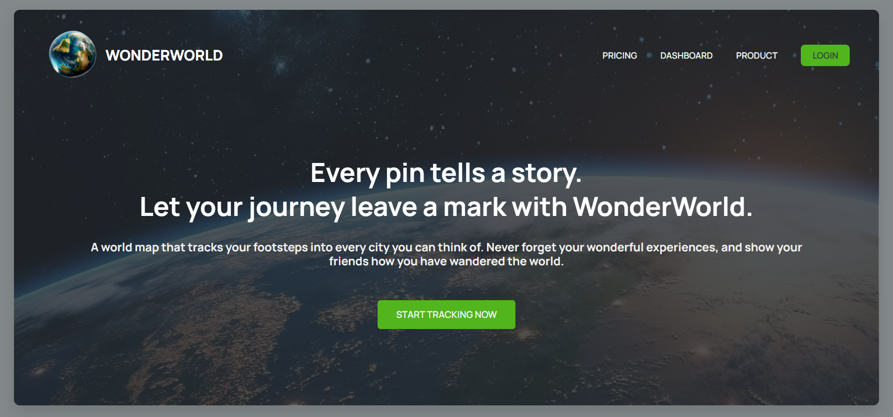

# 🌍 WonderWorld - Every Pin Tells a Story

**WonderWorld** is an interactive map that turns your travels into a beautiful visual journey.
With every city you visit, leave a pin to mark your footsteps and relive the memories anytime you want.

> ✨ *Let your journey leave a mark with WonderWorld.*

---

## 📌 Features

* 📍 Pin every city you've visited on a dynamic world map.
* 🗺️ Track and visualize your global adventures.
* 🧳 Never forget your travel experiences.
* 🌐 Share your personal travel map with friends.

---

## 📸 Preview

🔗 **Website:** [adarsh-wonderworld.netlify.app](https://adarsh-wonderworld.netlify.app/)




---

## 🚀 Getting Started

### 1. Clone the repository

```bash
git clone https://github.com/Adarsh152004/Wonder-World
cd WonderWorld
```

### 2. Install dependencies

```bash
npm install
```

### 3. Add your Supabase credentials

Create a `.env` file in the project root:

```
VITE_SUPABASE_URL=your_supabase_url
VITE_SUPABASE_ANON_KEY=your_supabase_anon_key
```

### 4. Run the app

```bash
npm run dev
```

Your project will run on **[http://localhost:5173](http://localhost:5173)**

---

## 🛠️ Built With

* ⚡ [Vite](https://vitejs.dev) – Next-gen frontend tooling
* 🎨 [Tailwind CSS](https://tailwindcss.com) – Utility-first styling
* 🧩 [Supabase](https://supabase.com) – Database and authentication
* 🌍 Deployed on [Netlify](https://www.netlify.com)

---


## 💚 Contributing

Contributions are welcome!
Feel free to fork the repo and create a pull request with your improvements.


